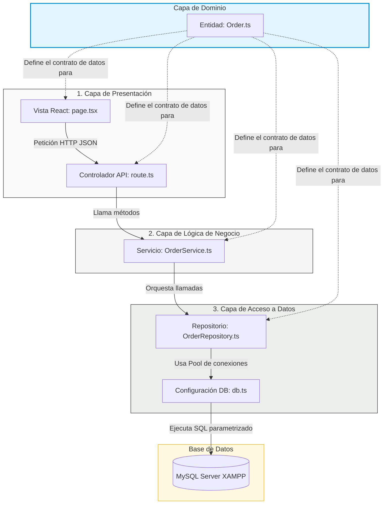
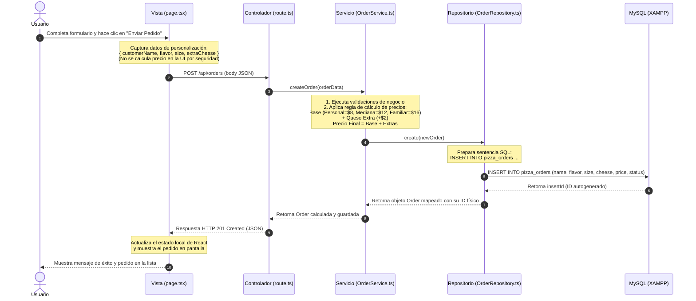
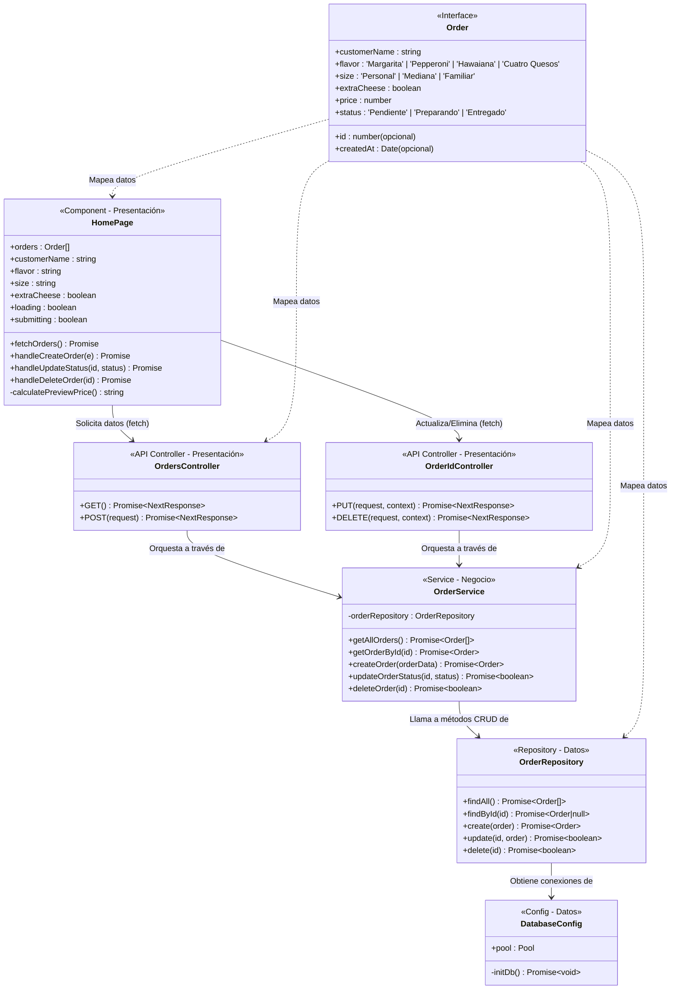

# INFORME TÉCNICO Y ACADÉMICO: SISTEMA PIZZAFLOW
## Arquitectura por Capas con Next.js, React Bootstrap y MySQL

---

## 1. RESUMEN EJECUTIVO

Este proyecto, **Pizzería PizzaFlow**, ha sido desarrollado con fines pedagógicos y profesionales para ilustrar de forma práctica y transparente el patrón de **Arquitectura por Capas** (N-Tier Architecture). El sistema modela una actividad cotidiana y comprensible por cualquier persona: la gestión y procesamiento de **Pedidos de Pizza**.

La aplicación no solo sirve como un sistema de facturación y seguimiento de pedidos funcional, sino que también integra una herramienta educativa en tiempo real: un **Visualizador de Código** que permite mapear cómo interactúa la interfaz gráfica (Frontend) con los archivos TypeScript y las consultas SQL físicas almacenadas en la base de datos **MySQL (vía XAMPP)** de manera secuencial.

---

## 2. ESPECIFICACIONES TECNOLÓGICAS

El ecosistema tecnológico ha sido seleccionado cuidadosamente para garantizar robustez, tipado estricto y una experiencia de usuario premium:

| Componente | Tecnología | Rol en el Sistema |
| :--- | :--- | :--- |
| **Frontend / UI** | React 19 + React Bootstrap 2.10 | Presentación visual y captura de interacciones del usuario. |
| **Arquitectura de Servidor** | Next.js 16 (App Router) | Enrutamiento estático, dinámico y controladores de API REST. |
| **Lenguaje de Programación** | TypeScript 5 | Tipado estricto transversal en todas las capas. |
| **Capa de Base de Datos** | MySQL 8 (Motor InnoDB) | Almacenamiento físico relacional persistente de los datos. |
| **Controlador de Base de Datos**| `mysql2` (Promisificado) | Pool de conexiones optimizado y consultas parametrizadas. |

---

## 3. DIAGRAMAS DE LA APLICACIÓN (MERMAID)

### 3.1. Diagrama de Estructura de Capas
El siguiente diagrama ilustra la división clásica de responsabilidades, mostrando que las dependencias fluyen estrictamente de arriba hacia abajo (Presentación $\rightarrow$ Negocio $\rightarrow$ Datos):

### 3.2. Diagrama de Secuencia: Ciclo de Vida del Flujo "Crear Pedido"
Este diagrama detalla cronológicamente cómo viajan los datos y qué métodos se ejecutan a lo largo de las capas cuando un cliente realiza una orden:

### 3.3. Diagrama de Clases UML del Sistema
Detalle estructural de los métodos, atributos, tipos y relaciones entre los distintos módulos:

---

## 4. ANÁLISIS DETALLADO DE LAS CAPAS DE ARQUITECTURA

### 4.1. Capa de Dominio (Transversal)
* **Archivo Clave:** [`src/models/Order.ts`](file:///d:/DOCUMENTS/UNIVERSIDAD/9no%20semestre/New%20folder/ArquitecturaPorCapas/src/models/Order.ts)
* **Descripción:** Se define como una "capa transversal" porque **no tiene dependencias externas**. Al contrario, todas las demás capas dependen de ella. Contiene la definición del modelo conceptual de los datos (`Order`).
* **Valor Técnico:** En TypeScript, esta capa actúa como un contrato rígido. Si alteramos la interfaz del pedido de pizza, el compilador inmediatamente señalará errores en la UI, el Servicio o el Repositorio, garantizando la seguridad en el refactor del código.

### 4.2. Capa de Presentación (Frontend & Controladores API)
* **Archivos Clave:**
  * Vista (UI): [`src/app/page.tsx`](file:///d:/DOCUMENTS/UNIVERSIDAD/9no%20semestre/New%20folder/ArquitecturaPorCapas/src/app/page.tsx)
  * Controladores: [`src/app/api/orders/route.ts`](file:///d:/DOCUMENTS/UNIVERSIDAD/9no%20semestre/New%20folder/ArquitecturaPorCapas/src/app/api/orders/route.ts) y [`src/app/api/orders/[id]/route.ts`](file:///d:/DOCUMENTS/UNIVERSIDAD/9no%20semestre/New%20folder/ArquitecturaPorCapas/src/app/api/orders/%5Bid%5D/route.ts)
* **Descripción:** Es la frontera del sistema con el mundo exterior.
  * La **UI** renderiza los formularios estructurados en Bootstrap y gestiona el flujo asíncrono hacia el servidor (`fetch`).
  * Los **Controladores (API Routes)** actúan como la puerta de entrada al backend. Escuchan peticiones HTTP (GET, POST, PUT, DELETE), desempaquetan el JSON, lo delegan a la capa de negocio y empaquetan las respuestas en un formato REST universal.
* **Valor Técnico:** Los controladores aíslan el protocolo de red (HTTP) del resto de la aplicación. Si en el futuro cambiamos a GraphQL o gRPC, la lógica de negocio (`OrderService`) permanecería inmutable; solo cambiaría esta capa de controladores.

### 4.3. Capa de Lógica de Negocio (Service Layer)
* **Archivo Clave:** [`src/services/OrderService.ts`](file:///d:/DOCUMENTS/UNIVERSIDAD/9no%20semestre/New%20folder/ArquitecturaPorCapas/src/services/OrderService.ts)
* **Descripción:** Representa el "cerebro" del software. Orquesta los flujos de datos e implementa las políticas operativas del negocio de pizzas.
* **Mecanismos Clave de Negocio:**
  1. **Validación Antifraude:** El cliente podría adulterar los datos enviados por la red. La capa de negocio realiza validaciones estrictas (por ejemplo, rechazar nombres menores a 3 letras o sabores no oficiales).
  2. **Cálculo de Precios Seguro:** La UI jamás envía el precio al backend. La capa de negocio determina el costo total basándose en los parámetros de la pizza enviados. Esto impide que un atacante altere los precios de compra desde el inspector del navegador.
* **Valor Técnico:** El servicio no sabe (ni le interesa) si la interfaz de usuario es una página web, una app móvil o un comando de consola, ni tampoco si los datos se guardan en un archivo Excel, MySQL o Postgres. Contiene puramente la lógica de la pizzería.

### 4.4. Capa de Acceso a Datos (DAL / Repository Pattern)
* **Archivos Clave:**
  * Conexión y Autocuración: [`src/config/db.ts`](file:///d:/DOCUMENTS/UNIVERSIDAD/9no%20semestre/New%20folder/ArquitecturaPorCapas/src/config/db.ts)
  * Repositorio: [`src/repositories/OrderRepository.ts`](file:///d:/DOCUMENTS/UNIVERSIDAD/9no%20semestre/New%20folder/ArquitecturaPorCapas/src/repositories/OrderRepository.ts)
* **Descripción:** Se encarga exclusivamente de la persistencia de datos.
  * El **Repositorio** encapsula las sentencias SQL parametrizadas, protegiendo al sistema de ataques de Inyección SQL mediante placeholders (`?`).
  * El módulo de **Conexión (`db.ts`)** implementa un diseño *Self-Healing* (Autocurativo). Al importarse por primera vez, detecta si la base de datos física `tareas_db` y la tabla `pizza_orders` existen en el servidor MySQL local; si no, las crea sobre la marcha y las puebla con registros iniciales.
* **Valor Técnico:** Aísla el dialecto de base de datos. Si mañana la pizzería migra de MySQL a MongoDB, solo se reescribe el archivo `OrderRepository.ts` con las consultas NoSQL correspondientes. Las capas superiores (Servicio, Controlador y UI) no se enteran del cambio y siguen funcionando de forma idéntica.

---

## 5. BENEFICIOS Y JUSTIFICACIÓN DE LA ARQUITECTURA POR CAPAS

Implementar este patrón conlleva costos adicionales en la cantidad de archivos y abstracción inicial, pero ofrece beneficios incomparables en entornos de desarrollo profesional:

1. **Principio de Responsabilidad Única (SRP):** Cada módulo hace una sola cosa bien. La interfaz gráfica solo renderiza, el servicio calcula y valida, y el repositorio hace consultas SQL. Esto disminuye significativamente los errores colaterales al modificar código.
2. **Mantenibilidad:** Si hay un error en el cálculo del precio de las pizzas familiares, el programador sabe exactamente que debe abrir `OrderService.ts`. Si la consulta SQL falla por un campo incorrecto en MySQL, se dirige exclusivamente a `OrderRepository.ts`.
3. **Escalabilidad y Paralelismo:** En un equipo de desarrollo, un diseñador de frontend puede trabajar de forma aislada rediseñando `page.tsx` sin tocar una sola consulta a la base de datos, mientras que un ingeniero de base de datos puede optimizar los índices de MySQL o el pool de conexiones en `db.ts` de manera independiente.
4. **Testabilidad:** Permite ejecutar pruebas unitarias aislando capas mediante simulación de datos (*mocking*). Se puede evaluar la lógica matemática de `OrderService.ts` simulando que la base de datos responde de forma óptima, acelerando los procesos de control de calidad.

---

## 6. CONCLUSIONES

El diseño arquitectónico de **Pizzería PizzaFlow** cumple estrictamente con los lineamientos académicos de la Arquitectura por Capas y los estándares modernos de desarrollo de software utilizando el framework Next.js. 

Al separar la presentación de la lógica de negocio y del acceso a datos, se ha logrado un sistema de alta cohesión y bajo acoplamiento, garantizando un software robusto, escalable, fácil de mantener y con un altísimo valor didáctico para cualquier desarrollador de software.
