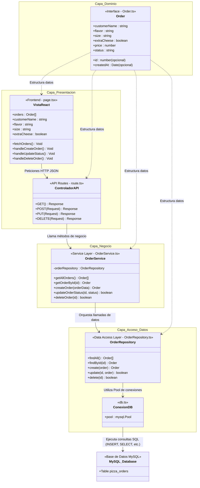

# Pizzería PizzaFlow: Ejemplo Práctico de Arquitectura por Capas

Este proyecto es una aplicación web interactiva diseñada específicamente para servir de **guía visual en exposiciones académicas** sobre la **Arquitectura por Capas**. Se enfoca en una actividad cotidiana y comprensible por cualquiera: **Pedir una Pizza**.

Utiliza **Next.js 16** con **React Bootstrap 2** y una base de datos local **MySQL** (XAMPP).

---

## 📐 Diagrama UML de Arquitectura (Mermaid)

El siguiente diagrama representa cómo viaja la información entre las capas del proyecto y cómo interactúan los archivos reales:



---

## 🏛️ Estructura del Código por Capas

El proyecto se divide de forma limpia en las siguientes capas de abstracción:

1. **Capa de Dominio (Transversal):**
   * **Archivo:** [`src/models/Order.ts`](file:///d:/DOCUMENTS/UNIVERSIDAD/9no%20semestre/New%20folder/ArquitecturaPorCapas/src/models/Order.ts)
   * **Responsabilidad:** Define el tipo `Order` (Pedido). Es la estructura de datos que viaja de capa en capa, unificando el lenguaje de toda la aplicación.
2. **Capa de Presentación:**
   * **Vista (Frontend):** [`src/app/page.tsx`](file:///d:/DOCUMENTS/UNIVERSIDAD/9no%20semestre/New%20folder/ArquitecturaPorCapas/src/app/page.tsx)
     * Interfaz interactiva donde registras pedidos, actualizas estados y eliminas registros.
     * **¡El Visualizador Didáctico!** A la derecha hay un panel con pestañas interactivas. Al hacer clic en cualquier acción, se cargan los **fragmentos de código reales de nuestro proyecto** para cada una de las capas. Esto te permite guiar tu exposición con el código en tiempo real.
   * **Controladores (API REST):** [`src/app/api/orders/route.ts`](file:///d:/DOCUMENTS/UNIVERSIDAD/9no%20semestre/New%20folder/ArquitecturaPorCapas/src/app/api/orders/route.ts) y [`src/app/api/orders/[id]/route.ts`](file:///d:/DOCUMENTS/UNIVERSIDAD/9no%20semestre/New%20folder/ArquitecturaPorCapas/src/app/api/orders/%5Bid%5D/route.ts)
     * Reciben las peticiones HTTP (`GET`, `POST`, `PUT`, `DELETE`), extraen los parámetros y delegan la resolución lógica al servicio de negocio.
3. **Capa de Lógica de Negocio (Service):**
   * **Archivo:** [`src/services/OrderService.ts`](file:///d:/DOCUMENTS/UNIVERSIDAD/9no%20semestre/New%20folder/ArquitecturaPorCapas/src/services/OrderService.ts)
   * **Responsabilidad:** Contiene las reglas y validaciones de negocio. 
     * **Seguridad en el Servidor:** La UI no envía el precio. El precio se calcula estrictamente aquí en base al tamaño (Personal = $8, Mediana = $12, Familiar = $16) y si tiene queso extra (+$2). Esto demuestra la separación de responsabilidades y la protección ante manipulaciones en el navegador.
     * Valida que el nombre de cliente tenga mínimo 3 caracteres y no exceda 100.
4. **Capa de Acceso a Datos (Repository):**
   * **Conexión:** [`src/config/db.ts`](file:///d:/DOCUMENTS/UNIVERSIDAD/9no%20semestre/New%20folder/ArquitecturaPorCapas/src/config/db.ts)
     * Configuración del pool de conexión a MySQL. Posee un sistema **autocurativo** que crea automáticamente la base de datos `tareas_db` y la tabla `pizza_orders` si no existen al arrancar la aplicación, poblándolas con datos iniciales.
   * **Repositorio:** [`src/repositories/OrderRepository.ts`](file:///d:/DOCUMENTS/UNIVERSIDAD/9no%20semestre/New%20folder/ArquitecturaPorCapas/src/repositories/OrderRepository.ts)
     * Contiene las consultas SQL nativas (`SELECT`, `INSERT`, `UPDATE`, `DELETE`). Es la única sección del sistema que conoce los detalles físicos de MySQL.

---

## 🚀 Guía de Puesta en Marcha

### 1. Iniciar MySQL (XAMPP)
1. Abre el panel de control de **XAMPP**.
2. Presiona **Start** en **Apache** y en **MySQL**.

### 2. Levantar la Aplicación Web
1. Abre una consola de terminal en esta carpeta.
2. Levanta el servidor de desarrollo:
   ```bash
   npm run dev
   ```
3. Abre tu navegador e ingresa a **[http://localhost:3000](http://localhost:3000)**.
4. La base de datos y la tabla de pizzas se habrán creado de manera **100% automática** al conectarse. Puedes comprobarlo abriendo phpMyAdmin en tu navegador.

---

## 🎤 Tips de Oro para tu Exposición (Cómo Explicarlo)

Cuando expongas frente a tu profesor u otros estudiantes, usa la aplicación en pantalla y sigue esta narrativa paso a paso:

1. **La Entrada de Datos (Presentación - UI):**
   * *"Escribo el nombre del cliente y elijo una pizza familiar con queso extra. Hago clic en 'Procesar'."*
   * *Muestra la pestaña **1. UI** en el panel:* *"En este momento, la UI toma los campos del formulario y hace una llamada HTTP POST a la API."*
2. **El Controlador (Presentación - API Router):**
   * *Cambia a la pestaña **2. Controlador**:* *"El controlador intercepta la llamada. Noten que el controlador NO realiza validaciones ni calcula el precio. Su única responsabilidad es recibir el JSON de la red y pasárselo al servicio de negocio."*
3. **La Lógica de Negocio (Service):**
   * *Cambia a la pestaña **3. Servicio**:* *"Esta es la capa más importante del backend. Por seguridad, el precio de la pizza no viene desde el navegador web del usuario (para evitar hackeos donde un cliente asigne un precio de $0.00). El precio es calculado en el servidor basándose en el tamaño de pizza elegido ($16 por una Familiar) y sumando $2 por el queso extra. Si el cliente escribe un nombre con menos de 3 caracteres, el servicio arroja un error e interrumpe el flujo antes de que toque la base de datos."*
4. **El Acceso a Datos (Repository):**
   * *Cambia a la pestaña **4. Repositorio**:* *"Una vez que el pedido es válido y su precio ha sido calculado, el servicio llama al repositorio. La responsabilidad del repositorio es estrictamente hablar con la base de datos. Ninguna otra capa escribe SQL crudo."*
5. **La Base de Datos (MySQL):**
   * *Cambia a la pestaña **6. MySQL SQL**:* *"El repositorio inyecta los datos de forma segura en la base de datos MySQL local conectada por XAMPP, guardando el registro permanente."*
6. **El Mapeo de Retorno:**
   * *Muestra la pestaña **5. Dominio**:* *"Todo el camino de ida y vuelta se realiza utilizando el modelo transversal 'Order', asegurando que todas las capas comprendan el mismo tipo de objeto."*
